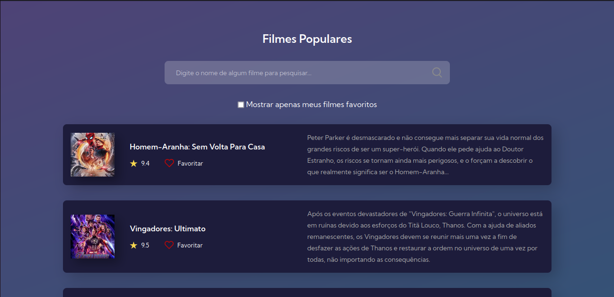

<h1 align="center"> 7DaysOfCode Github </h1>

  <a href="#-projeto">Projeto</a>&nbsp;&nbsp;&nbsp;|&nbsp;&nbsp;&nbsp;
  <a href="#-desafios">Desafios</a>&nbsp;&nbsp;&nbsp;

  

 

  

## 💻 Projeto

Durante os 7 Days de GitHub, iremos praticar algo que além de importantíssimo, será muito divertido. Iremos irá criar, do zero, um repositório no GitHub usando um template. Posteriormente, comecaremos a fazer requisições para esse repositório, tanto manualmente quanto através da IDE do Visual Studio Code. Trabalharemos com muitos conceitos que colocarão à prova os seus conhecimentos de GitHub.

## 🎯 Desafios

 ### Dia 1:
- No primeiro dia, você vai criar manualmente o seu repositório no GitHub. Você também irá alterar o arquivo ReadMe do seu perfil.

 ### Dia 2:
- Subir manualmente os arquivos e imagens para o seu repositório recém-criado do GitHub.

 ### Dia 3:
- Usar a IDE do Visual Studio Code e, clonar o repositório criado no GitHub para editá-lo localmente, na IDE.
 
 ### Dia 4:
- Inicialmente alterar o código para deixá-lo mais personalizado. Feito isso, terá que realizar o commit dessas alterações, tanto usando a IDE quanto comandos no Terminal do Visual Studio Code.
 ### Dia 5:
- Criar e publicar no repositório um commit errado e, posteriormente, revertê-lo, a fim de remover o erro do seu código.
 
 ### Dia 6:
- Lidar com conflitos. Inicialmente, forçaremos commits a partir de duas fontes diferentes. O desafio será resolver esse conflito e fazer um commit do resultado do seu merge.
 
 ### Dia 7:
- Colocar o projeto em produção usando o GitHub Pages do próprio GitHub.
